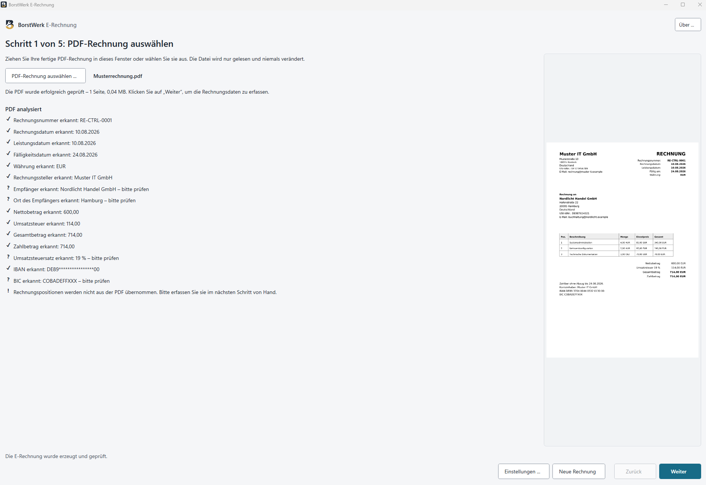
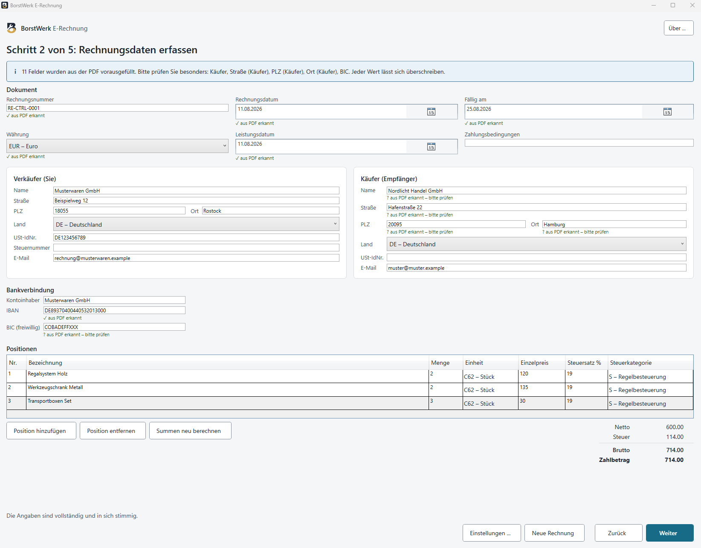
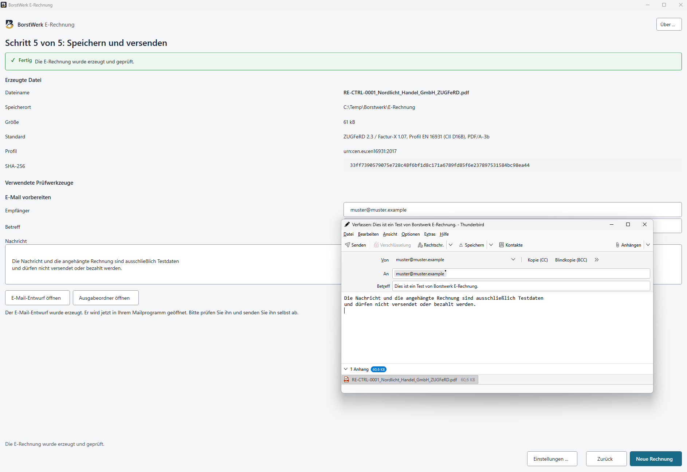

# BorstWerk E-Rechnung

> **Ein kleines Werkzeug für eine konkrete Aufgabe.**

**BorstWerk E-Rechnung** ist ein kostenloses Open-Source-Windows-Werkzeug für kleine Unternehmen,
Selbstständige und Vereine. Es erzeugt aus einer **bereits vorhandenen PDF-Rechnung** eine
**ZUGFeRD-/Factur-X-E-Rechnung** im Profil **EN 16931**. Das Ergebnis ist eine PDF/A-3-Datei mit
eingebetteten strukturierten Rechnungsdaten; die Verarbeitung läuft vollständig lokal auf dem
eigenen Rechner.

BorstWerk E-Rechnung ist ein Werkzeug der [BorstWerk-Werkzeugfamilie](https://github.com/Borstwerk).
BorstWerk entstand aus konkreten Aufgaben im eigenen Alltag und im Umfeld von Familie und Freunden:
Wenn für eine reale Aufgabe kein passendes kleines Werkzeug vorhanden war, entstand daraus manchmal
ein eigenes. E-Rechnung folgt derselben Grundidee – die Aufgabe lösen, ohne daraus unnötig eine
Plattform zu machen.

Sie ist ausdrücklich **kein Rechnungsprogramm**. Sie schreibt keine Rechnung, vergibt keine
Rechnungsnummer, führt keine Buchhaltung, verwaltet keine Kunden, erstellt keine Mahnungen und
versendet keine E-Mail von sich aus.

Gedacht ist sie für den Fall, dass die Rechnung schon fertig ist – geschrieben mit Word, Excel,
LibreOffice, einer Branchenlösung oder sonst einem Programm – und daraus jetzt eine E-Rechnung
werden soll.

> **Status:** Version 0.2.0 ist veröffentlicht.

## Download

**Aktuelle Version: 0.2.0**

Für Windows 10 und Windows 11 (64 Bit):

- **[MSI-Installer herunterladen](https://github.com/Borstwerk/E-Rechnung/releases/download/v0.2.0/BorstWerk-E-Rechnung-Setup.msi)** – empfohlen für die normale Installation und Updates
- **[Portable ZIP herunterladen](https://github.com/Borstwerk/E-Rechnung/releases/download/v0.2.0/BorstWerk-E-Rechnung-portable-win-x64.zip)** – ohne Installation verwendbar
- **[SHA-256-Prüfsummen](https://github.com/Borstwerk/E-Rechnung/releases/download/v0.2.0/SHA256SUMS.txt)**

[**Release Notes zu Version 0.2.0**](https://github.com/Borstwerk/E-Rechnung/releases/tag/v0.2.0)

## Neu in 0.2.0

- Rechnungspositionen aus klar aufgebauten digitalen PDF-Tabellen erkennen
- Mengeneinheiten wie Stunde und Stück übernehmen; fehlende Einheiten werden nicht geraten
- Käuferland, Käufer-USt-ID und Käufer-E-Mail verbessert erkennen
- EN16931-konforme Verkäuferidentifikation über BT-29, BT-30 oder BT-31
- sauberer Upgradepfad von 0.1.0 auf 0.2.0

Alle Einzelheiten stehen in den [Release Notes zu Version 0.2.0](https://github.com/Borstwerk/E-Rechnung/releases/tag/v0.2.0).

## In Entwicklung für 0.3.0

Der Entwicklungsstand auf `main` ergänzt einen getrennten read-only Prüfmodus
für bereits fertige ZUGFeRD-/Factur-X-Hybridrechnungen. Er zeigt technische
Dokumentangaben, die eingebettete Rechnungs-XML, Kerndaten, Befunde und eine
SHA-256-Prüfsumme, ohne die Quelldatei zu verändern.

Diese technische Bestandsaufnahme ist keine vollständige EN-16931- oder
PDF/A-Konformitätsprüfung. Sie ist noch nicht Bestandteil des oben verlinkten
Downloads von Version 0.2.0.

## Was die Anwendung kann

- eine vorhandene PDF-Rechnung auswählen und örtlich prüfen
- vorhandenen PDF-Text auslesen und das Formular damit vorbelegen
- die erkannten Angaben kontrollieren, korrigieren und ergänzen
- wiederkehrende eigene Firmendaten einmalig hinterlegen
- eine ZUGFeRD-/Factur-X-Rechnung im Profil EN 16931 erzeugen
- die strukturierten Rechnungsdaten als XML in eine PDF/A-3-Datei einbetten
- das Ergebnis erneut öffnen und gegenprüfen
- einen Prüfbericht mit SHA-256-Prüfsumme schreiben
- einen E-Mail-Entwurf als `.eml`-Datei für das vorhandene Mailprogramm vorbereiten

Die Original-PDF wird dabei ausschließlich gelesen und niemals verändert.

## Was die Anwendung bewusst nicht kann

- kein Rechnungsprogramm: Sie schreibt keine Rechnungen und vergibt keine Rechnungsnummern
- keine Buchhaltung, keine Kundenverwaltung, kein Mahnwesen
- kein automatischer E-Mail-Versand – der Entwurf wird vorbereitet, abgeschickt wird er von Hand
- keine Texterkennung (OCR) für eingescannte Rechnungen
- keine Übernahme von Rechnungspositionen aus beliebigen Tabellen – nur aus klar aufgebauten,
  und dann geschlossen oder gar nicht
- keine Steuer- oder Rechtsberatung: Ob eine Rechnung inhaltlich und steuerlich richtig ist,
  kann die Anwendung nicht beurteilen
- keine Zusicherung, dass sich jede beliebige PDF verarbeiten lässt
- keine Verarbeitung kennwortgeschützter oder rechtebeschränkter PDFs
- keine Veränderung digital signierter PDFs

## Vor der ersten Rechnung

Bitte öffnen Sie nach dem ersten Start zunächst **Einstellungen** und hinterlegen Sie dort Ihre
eigenen Firmendaten. Dazu gehören insbesondere Firmenname und Anschrift sowie – soweit vorhanden –
USt-IdNr. oder Steuernummer, Registerkennung, E-Mail-Adresse und Bankverbindung.

**Wenn Sie keine USt-IdNr. haben:** Eine E-Rechnung muss den Rechnungssteller eindeutig
ausweisen. Dafür genügt eine dieser drei Angaben – USt-IdNr., Registerkennung (etwa die
Handelsregisternummer) oder die Lieferanten- beziehungsweise Kreditorennummer, die Ihr Kunde
Ihnen mitgeteilt hat. Eine Steuernummer allein reicht dafür nicht aus; sie ist eine zulässige
zusätzliche Angabe, aber keine Ersatzkennung. Die Lieferantennummer tragen Sie je Rechnung im
Formular ein, weil sie bei jedem Kunden eine andere ist.

Diese Angaben dienen nicht nur als Vorlage für wiederkehrende Felder. Sie helfen der Anwendung
auch dabei, in einer PDF zuverlässig zu unterscheiden, **wer Rechnungsteller und wer
Rechnungsempfänger ist**. Ohne gespeicherte Firmendaten kann der Rechnungsteller bei der ersten
PDF deshalb bewusst leer bleiben und muss dann von Hand eingetragen werden.

Die Firmendaten werden lokal gespeichert und können jederzeit geändert werden.

## So läuft es ab

1. **PDF auswählen und prüfen.** Die vorhandene Rechnung wird geprüft und als Vorschau angezeigt.
2. **Rechnungsdaten prüfen und ergänzen.** Erkannte Angaben stehen im Formular; fehlende oder
   unsichere werden ergänzt.
3. **Sichtbare Rechnung und strukturierte Daten vergleichen.** Vor der Erzeugung ist ausdrücklich
   zu bestätigen, dass beides übereinstimmt.
4. **E-Rechnung erzeugen und prüfen.** Die strukturierte XML wird erstellt, gegengeprüft und in
   die PDF/A-3-Datei eingebettet.
5. **Speichern und E-Mail vorbereiten.** Die fertige Datei und der Prüfbericht werden abgelegt,
   auf Wunsch dazu ein `.eml`-Entwurf.

## Screenshots

**PDF auswählen und analysieren**

**Rechnungsdaten prüfen und ergänzen**

**E-Rechnung speichern und E-Mail-Entwurf vorbereiten**

## Welche Daten aus der PDF gelesen werden

Bei digital erzeugten PDFs liest die Anwendung den bereits vorhandenen Text örtlich aus und füllt
das Formular damit vor. Erkannt werden unter anderem Rechnungsnummer, Rechnungs-, Leistungs- und
Fälligkeitsdatum, Währung, die Käuferangaben aus dem Adressblock, die eigenen Angaben aus der
gespeicherten Firmenvorlage, IBAN und BIC sowie Netto-, Steuer-, Brutto- und Zahlbetrag samt
Steuersätzen.

Jeder erkannte Wert bleibt sichtbar und änderbar. Unsichere Werte werden gekennzeichnet oder gar
nicht erst übernommen.

**Rechnungspositionen** werden aus klar aufgebauten Tabellen übernommen: eine Seite, ein
eindeutiger Tabellenkopf, die Steuersätze 7 % oder 19 %, und die Summe der Positionen muss die
Summe im Dokument treffen. Passt eine dieser Bedingungen nicht, wird **keine einzige** Position
übernommen und die Tabelle ist von Hand zu erfassen – eine halb ausgefüllte Tabelle sähe fertig
aus und wäre falsch. Haben Sie bereits selbst Positionen eingetragen, bleiben diese unangetastet.

Bei der **Mengeneinheit** kommt es darauf an, was in der Rechnung steht:

- Steht dort eine unterstützte Einheit – Stück, Stunde, Kilogramm oder Meter, in einer eigenen
  Spalte oder direkt hinter der Menge –, wird sie übernommen.
- Nennt die Rechnung **gar keine** Einheit, werden die Positionen trotzdem übernommen und das
  Feld bleibt leer. Beide Schritte sagen Ihnen, bei wie vielen Positionen das so ist. Bitte
  ergänzen Sie die Einheit; ohne sie entsteht keine Rechnung. Ein stillschweigend eingesetztes
  „Stück“ wäre bei einer Stundenrechnung nicht aufgefallen.
- Steht dort eine Einheit, die diese Anwendung nicht kennt, wird die ganze Tabelle nicht
  übernommen.

## Welche PDFs sich verwenden lassen

**Der direkte Weg.** Geeignete PDFs werden unverändert übernommen und um die fehlenden
PDF/A-3-Bestandteile ergänzt. Der Text der Rechnung bleibt dabei Text. Dieser Weg hat immer
Vorrang.

**Die sichtbare Kopie.** Fehlt einer Datei nur die Einbettung der verwendeten Schriftarten und
lassen sich ihre Seiten zuverlässig darstellen, kann die Anwendung stattdessen eine sichtbare
Kopie erzeugen: Sie stellt jede Seite örtlich dar und baut daraus ein neues Dokument. Das
geschieht **nie automatisch** – Sie müssen ausdrücklich zustimmen, und vorher steht dort, was es
kostet:

- Das Original bleibt unverändert.
- Der sichtbare Seiteninhalt bleibt erhalten.
- Der Text der neuen Datei ist danach nicht mehr markierbar und in der Anzeige nicht mehr
  durchsuchbar.
- Verknüpfungen und Formularfunktionen gehen verloren.
- Die Datei kann größer werden.
- Die Rechnungsdaten selbst bleiben über die eingebettete XML vollständig maschinenlesbar – für
  den Empfänger einer E-Rechnung ist das der Teil, der zählt.

**Was abgelehnt wird.** Die sichtbare Kopie ist kein Rettungsanker für jede problematische Datei.
Abgelehnt werden weiterhin beschädigte PDFs, solche mit Öffnungs- oder Besitzerkennwort, digital
signierte, solche mit aktiven Inhalten wie JavaScript – und solche, an denen weitere Anhänge
hängen, die in einer sichtbaren Kopie verloren gingen. In jedem Fall nennt die Anwendung den
Grund und, wo möglich, was sich im Ausgangsprogramm umstellen lässt.

**Eingescannte Rechnungen.** Eine reine Bild-PDF lässt sich verarbeiten, sofern sie sonst geeignet
ist. Ihre Rechnungsdaten werden dabei aber **nicht** aus dem Bild gelesen – eine Texterkennung
gibt es nicht. Die Anwendung sagt das geradeheraus und erfindet nichts; die Angaben sind von Hand
zu erfassen.

## Was mit Ihren Daten geschieht

Die gesamte Verarbeitung läuft auf Ihrem Rechner.

- Rechnungsdaten bleiben örtlich.
- Keine Cloud-Verarbeitung, kein Webdienst, keine Cloud-KI.
- Kein Benutzerkonto, keine Anmeldung.
- Keine Telemetrie, keine Werbung.
- Rechnungen, Anschriften und Bankverbindungen werden nicht übertragen.
- Die Original-PDF wird nur gelesen.
- Eine E-Mail wird nie ohne Ihr Zutun versendet.

## Eigene Firmendaten

Wiederkehrende Angaben lassen sich einmalig hinterlegen: Firmenname und Anschrift, USt-IdNr. oder
Steuernummer, Registerkennung, E-Mail-Adresse, Kontoinhaber mit IBAN und BIC, Standardwährung,
Zahlungsbedingungen, ein Standardtext für die E-Mail und das Ausgabeverzeichnis. Sensible Angaben
wie die IBAN werden unter Windows geschützt abgelegt.

## Der Prüfbericht

Zu jeder erzeugten E-Rechnung entsteht ein Prüfbericht. Er hält fest:

- die erzeugte Datei mit Größe und SHA-256-Prüfsumme
- Rechnungsnummer, Beteiligte und Standardangaben
- die festgestellten Fehler und Warnungen
- welche Prüfungen tatsächlich gelaufen sind
- auf welchem Weg die PDF verarbeitet wurde – direkt übernommen oder als sichtbare Kopie

Die installierte Anwendung führt ihre eingebauten Prüfungen aus. Unabhängige Referenzwerkzeuge
gehören zur Entwicklung und zur Freigabe und werden **nicht** mitinstalliert. Hat keine externe
Prüfung stattgefunden, schreibt der Bericht genau das – eine nicht durchgeführte Prüfung wird nie
als bestandene dargestellt.

## Installation

- Windows 10 oder Windows 11, 64 Bit
- eine vorhandene PDF-Rechnung

Mehr wird nicht gebraucht. Die Anwendung bringt alles Nötige mit; weder .NET noch Java müssen
nachinstalliert werden.

Für die normale Nutzung ist das MSI-Installationspaket vorgesehen. Es installiert
standardmäßig **nur für den aktuellen Benutzer** und kommt ohne Administratorrechte aus. Es legt
einen Eintrag im Startmenü an, auf Wunsch zusätzlich eine Desktopverknüpfung, und lässt
persönliche Einstellungen bei der Deinstallation unangetastet. Alternativ gibt es eine portable
ZIP-Fassung, die sich ohne Installation starten lässt.

## Bekannte Grenzen

Die wichtigsten stehen oben unter „Was die Anwendung bewusst nicht kann“ und „Welche PDFs sich
verwenden lassen“. Ausführlich: [`docs/KNOWN-LIMITATIONS.md`](docs/KNOWN-LIMITATIONS.md).

## Fehler und Verbesserungsvorschläge

Einen Fehler gefunden oder eine Idee für BorstWerk E-Rechnung?

- [Fehler melden](https://github.com/Borstwerk/E-Rechnung/issues/new?template=bug_report.yml)
- [Verbesserung vorschlagen](https://github.com/Borstwerk/E-Rechnung/issues/new?template=feature_request.yml)

Bitte **keine echten Rechnungen oder andere Dateien mit vertraulichen, personenbezogenen oder
Bankdaten hochladen**. Verwenden Sie nach Möglichkeit anonymisierte oder künstliche Beispieldaten.

## Entwicklung und Transparenz

**KI-gestützte Entwicklung:** Bei der Entwicklung von BorstWerk E-Rechnung
werden generative KI-Werkzeuge unterstützend eingesetzt. Anforderungen,
Architekturentscheidungen, Code, Tests, Validierung und Releases werden durch
den Projektverantwortlichen geprüft. Die Verantwortung für die veröffentlichten
Versionen liegt beim Projektverantwortlichen.

## BorstWerk

BorstWerk ist ein privates, nicht-kommerzielles Projekt für kleine Werkzeuge und Arbeitsmodelle,
die aus konkreten Problemen im eigenen Alltag und im Umfeld von Familie und Freunden entstanden
sind oder daraus weiterentwickelt wurden.

Die gemeinsame Idee lautet:

> **Nicht jede Aufgabe braucht eine Plattform. Manchmal braucht sie einfach ein Werkzeug.**

Wo es zur Aufgabe passt, arbeiten BorstWerk-Projekte lokal, ohne Benutzerkonto, Werbung oder
Telemetrie. Grenzen werden bewusst dokumentiert. Jedes Projekt bleibt eigenständig und soll nicht
künstlich zu einer Plattform wachsen.

Derzeit gehören unter anderem dazu:

- **BorstWerk E-Rechnung** – dieses Werkzeug
- **BorstWerk GoBD-Doku** – in Entwicklung
- **KI-Regeln** – Werkzeugkasten für kontrollierte KI-Arbeit; öffentliche Veröffentlichung in Vorbereitung

Übersicht: [github.com/Borstwerk](https://github.com/Borstwerk)

---

Entwicklerinnen, Entwickler und Mitwirkende finden Hinweise zu Aufbau, Bauen und Tests in
[`DEVELOPMENT.md`](DEVELOPMENT.md).